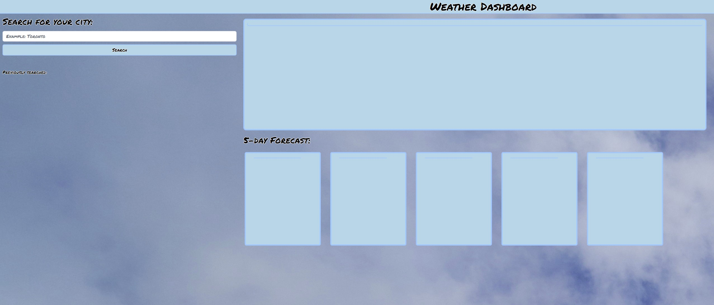

# 06 Server-Side APIs: Weather Dashboard

## Deployment URL

url:

## Mock-Up



## About

```

- created a weather dashboard with form inputs

- when I search for a city I am presented with current and future conditions for that city and that city is added to the search history.

- when I view current weather conditions for that city I am presented with the city name, the date, an icon representation of weather conditions, the temperature, the humidity, and the wind speed

- when I view future weather conditions for that city I am presented with a 5-day forecast that displays the date, an icon representation of weather conditions, the temperature, the wind speed, and the humidity

- when I click on a city in the search history it places it in my search bar allowing me to resubmit that city to display the weather.

```

## Contributors

```

- Austin Grech

```
